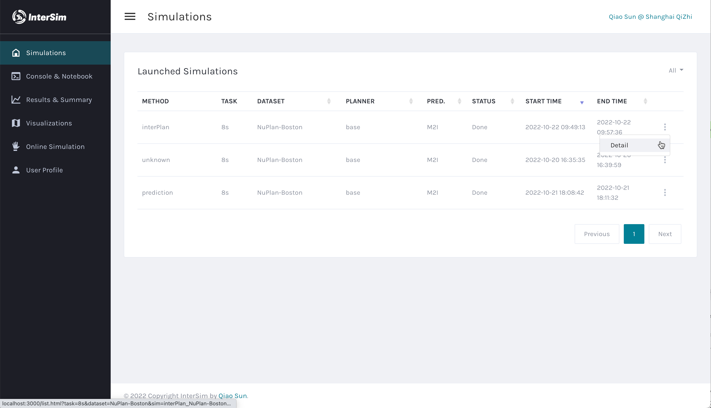

# InterSim

InterSim is a simulator for closed-loop interactive simulations with real on-road data and maps. Without over-promising, the best use case for InterSim Beta is to test your planning system before deployment extensively. If you want to test your planner with a large real-world dataset, you should consider InterSim. InterSim models real-world drivers' behaviors against new conflicts with relation prediction models. InterSim now supports both Waymo Open Motion Dataset and the NuPlan dataset.

Follow the instructions below to setup an environment or follow the tutorials if you prefer jupyter notebooks.

# Install and Quick Start

InterSim runs on pure Python with NO C/C++, NO ROS, and NO CARLA. InterSim is designed to be light and easy to use for all researchers.

## Create a new Conda environment

It is a good time for you to create a new environment for InterSim. We recommand Anaconda.

## Install Dataset

InterSim leverages the APIs from the datasets to load data. It is compulsory for you to at least install one dataset to use InterSim. Loading other open or customized datasets requires writing your own dataloader.

### With Waymo Open Motion Dataset

Register and download the WOMD dataset (note they have two data formats for you to choose from, please download the tfexample.tfrecord files). InterSim loops and loads tfexample files in a specified folder per simulation. To load WOMD dataset, all you need is tensorflow installed in your environment. Check tensorflow by running the followying in python.

`import tensorflow as tf`

### With NuPlan

Or register and download the NuPlan dataset. There are two folders, one for maps and one for scenarios. To load the NuPlan dataset, you have to make some effort to install the NuPlan's API following their [official install instructions](https://nuplan-devkit.readthedocs.io/en/latest/installation.html). Check with the following command in python.

`import nuplan`

## Install InterSim

To install InterSim, run `python setup.py install` in the simulator folder and you should be good. Note for local simulations with visualization, you need to install Tinker (following the readme file). And you can skip installing Tinker if you run InterSim on a server without a monitor. Check with the following import (inside the path of the simulator folder).

`import interactive_sim`

And here are all packages you need in `setup.py`:

- gym==0.18.3: Note later gym requires additional parameters hence incompatible to InterSim Beta
- tk: Tinker for online per-step visualization
- Cython: Optional, required if you use our default relation predictor
- tqdm: Also optional


## Setup the config

You can use the default config setting for a quick run of the simulation. The default config setting is in the `config.py` file. 

InterSim currently has 3 running modes:

0 = debug with per step visualization (Note: you need a monitor for this mode)
1 = batch simulation without per step visualization
2 = load playback and visualize with Python

Visualization with mode 0 is like the image below.


Set the running mode by changing the `running_mode` and set the dataset by changing the `dataset` in the config.py file. Specify the dataset location by changing `tf_example_dir` for WOMD or changing paths in the `data_path` for NuPlan.

Now change the `save_log_every_scenario` in the `config.py` to `True` to save logs and playbacks. We will talk about other settings in the following sections or other tutorials when we need to change them.


## Run a quick simulation with default planners

Now you can run a quick simulation with either mode 0 or 1 with either WOMD or NuPlan dataset, depending on which you installed and downloaded before, by running the following command in your terminal in the `simulator` folder.

`python sim.py --max_scenarios 5`

This command will run a quick series of simualtions covering 5 scenarios. InterSim will print simulation results with our default metrics after the simulation is finished. You should see this message printed in the end if no error occured.

"Simulation Finished!"

## With default relation predictor

InterSim leverages a pretrained default relation predictor by default. You can turn off the relation predictor by setting `predict_relations_for_ego` in the config to `false` and all agents will yield to the conflict by default (potential dead lock warning).

The deafult relation predictor requires loading a pre-trained model. You can download this model from [Google Drive](https://drive.google.com/drive/folders/1oDkIcttHwcaFSir1L02tp2U8mX20NEk1?usp=sharing). Note this model was trained with WOMD and will not work properly on NuPlan dataset. 

### Compile Cython Scripts

InterSim provides several default predictors to use. These predictors use Cython scripts to normalize and pack data for the models.
The default setting will trigger a relation predictor from `M2I/relation_predictor`. 
If you are using any of these default predictors, you need to travel to its `src` folder and compile the Cython script first. For the default setting with the relation predictor, travel to the src folder with

`cd prediction/M2I/relation_predictor/src/`

and compile Cython scripts with

`cython -a utils_cython.pyx && python setup.py build_ext --inplace`

If you need to use another predictor, travel to the src folder and run the same command to compile the Cython script first.

You might need to compile the Cython scripts for the marginal predictor as well to run with the default settings.

`cd prediction/M2I/marginal_prediction/src/`
`cython -a utils_cython.pyx && python setup.py build_ext --inplace`

## Check results

The default path for simulation results is `./sim_result/`. Inside this folder, you should see a folder named after the starting time of your simulation in a month-day-hour-minute format. The simulation results are orgnized in the following way:

```
sim_result
│   sim_rst_xxx.log
└───playback
│   │   xxx00001.playback
│   │   xxx00002.playback
│   │   ...
└───json
    │   xxx00001.json
    │   xxx00002.json
    │   ...    
```

Next, let's check the simulation results on the dashboard. For InterSim Beta, you would need to launch a local server with flask for python server and npm for html+javascript client on your browser. Install the following depencencies to use our browser visualizations.

![]

- [npm](https://docs.npmjs.com/downloading-and-installing-node-js-and-npm)
- [flask](https://flask.palletsprojects.com/en/2.2.x/installation/#)
- [flask-cors](https://flask-cors.readthedocs.io/en/latest/)

Run `flask --app dashboard_server run` to launch the Python server in your terminal. And then travel to the `dashboard` by `cd ../dashboard` from the `8sBeta` folder and run `npm run dev` to fire a local client of the dashboard on your default browser. The default ip for the Python server is http://127.0.0.1:5000. Use `flask --app dashboard_server run --host=0.0.0.0 --port=80` to specify another ip address or port.

After the running npm command, you should see the index page pop up as the follows. You should be able to see one and only one simulation, which is the one you just ran, in the list. Let's click the dropdown button and click details to check all scenarios ran in this simulation.



The link should direct you to the Results & Summary page as shown below. All scenarios in this simulation are listed with there breif summaries. Click the dropdown button and click the visaulize to show this scenario in details.


And this link should direct you to the visualization page as shown below. Click the play button in the middle of the bottom to play this scenario.


# Build, test or integrate your planner

## Create and Import Your Planner

To simulate in a closed-loop fashion, InterSim has a planenr for all environment agents `env_planner.py` and a planner for the ego vehicle `base_planenr.py`. 

The first step to create a new planner is to create a new python script in the folder `./plan`. The most easy way is to copy and start from the `dummpy_planner.py`. Follow the following steps to register and switch a new planner:

1. Rename your planner script at your preference, like `your_planenr.py`.
2. Rename your planner class, for example `class YourPlanner(EnvPlanner):`. It is compulsory to inherit from the EnvPlanner.
3. Import your planner at `drive.py`, for example `from plan.your_planner import YourPlanner`
4. Initialize your planner in the configure function at `drive.py` with a customized config value, like `your_planner_name`.
5. Change the parameter of `ego_planner` to your cusomized planner name, like `your_planner_name`.

Try to run the simulation again, now InterSim should you your new planner instead of the default ego_planner.

`python sim.py --max_scenarios 5`

# More

To build and test your own planner and learn more about the data APIs, check out our tutorial at `tutor_planner.ipynb`.

We hope this tool can help the community push the frontline of interactive planning systems. If you are enlightened, please consider citing our paper. If you like our idea and want to give your planner a test, follow our easier-than-you-thought tutorials and fork our codes. Moreover, building a realistic planning simulator is a big challenge demanding broad collaborations across multiple communities. If you are annoyed by some bugs, unfinished functions, or lacking fundamental extensions, please consider contributing your effort and building it for all. And you are more than welcome to connect with us if you don't know where to start.

# Citation

If you found this repo useful to your research, please consider citing

```angular2html
@inproceedings{sun2022intersim,
title={{InterSim}: Interactive Traffic Simulation via Explicit Relation Modeling},
author={Sun, Qiao and Huang, Xin and Williams, Brian and Zhao, Hang},
booktitle={2022 IEEE/RSJ International Conference on Intelligent Robots and Systems (IROS)},
year={2022},
organization={IEEE}
}
```


